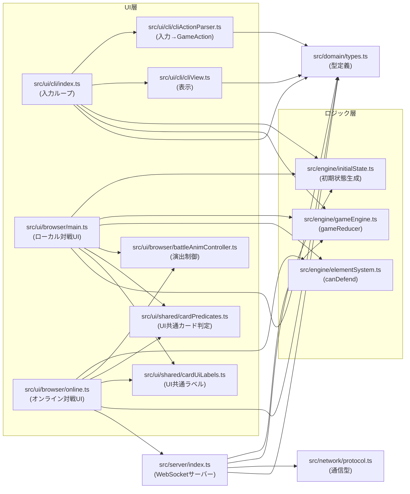

# UI参照関係マップ

このファイルは、**どのUIがどのロジックを参照しているか**を素早く把握するための図です。

## エントリーポイント

- `npm run dev` → `src/ui/cli/index.ts`（CLI UI）
- `npm run gui` → `src/ui/browser/main.ts` / `src/ui/browser/online.ts`（ブラウザ UI）
- `npm run server` → `src/server/index.ts`（オンライン対戦サーバー）

## 参照関係図（Mermaid）

## 役割の見分け方（短縮）

- **`engine/*`**: ルール本体（UI非依存）
- **`ui/*`**: 表示・入力・演出（UI依存）
- **`ui/shared/*`**: UI同士の共通部品
- **`domain/types.ts`**: UI/Engine/Serverの共通契約（型）
