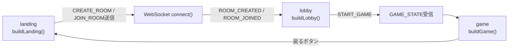
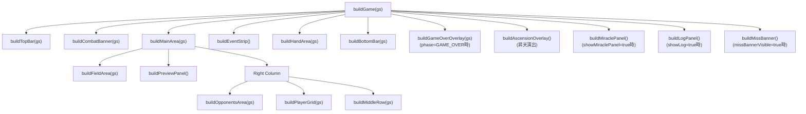
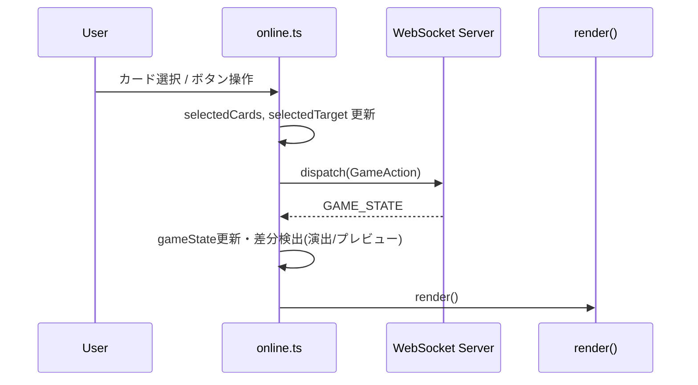

# `online.ts` UI 図解ガイド

このファイルは `src/ui/browser/online.ts` の UI 構造を、**画面遷移**と**ゲーム画面コンポーネント**の2軸で説明します。

## 1) 画面遷移（screen）

`online.ts` は `screen: "landing" | "lobby" | "game"` を持ち、`render()` が毎回 `#app` を再構築します。

### 補足
- `ROOM_CREATED / ROOM_JOINED / LOBBY_STATE / GAME_STATE` は `ws.addEventListener("message")` で処理。
- `GAME_STATE` を受け取るたびに `gameState` を更新して `render()`。

---

## 2) ゲーム画面 (`buildGame`) のUIツリー

### どこを見ると分かりやすいか
- **全体レイアウトの起点**: `buildGame()`
- **中央の主戦場**: `buildMainArea()`
- **操作の中心**: `buildHandArea()` + `buildMiddleRow()` + `buildPlayerGrid()`
- **オーバーレイ系**: `buildGameOverOverlay()` / `buildAscensionOverlay()` / `buildMiraclePanel()` / `buildLogPanel()`

---

## 3) 入力と状態更新の流れ（UIイベント → サーバー → 再描画）

### 差分検出でやっていること（要点）
- 攻撃開始時の `defenseContext` 構築
- 全体攻撃の命中/ミス演出 (`runAreaAttackAnim`, miss banner)
- 防御確定後の結果プレビュー作成
- HP0 到達時の昇天オーバーレイ表示

---

## 4) `online.ts` の責務分割（読む順番ガイド）

1. **接続/受信**: `connect()`
2. **描画入口**: `render()`
3. **画面ビルダー**: `buildLanding()` → `buildLobby()` → `buildGame()`
4. **ゲーム内パーツ**: `buildMainArea()`, `buildHandArea()`, `buildActionsPanel()` など
5. **共通UI部品**: `makeCardTile()`, `makeCardPanel()`, `renderCardDetail()`

---

## 5) 依存関係（online.tsが参照する主なモジュール）

- `../shared/cardPredicates.ts`（UI共通カード判定）
- `../shared/cardUiLabels.ts`（UI共通ラベル）
- `./battleAnimController.ts`（演出）
- `../../engine/elementSystem.ts`（属性相性チェック `canDefend`）
- `../../domain/types.ts`（型）
